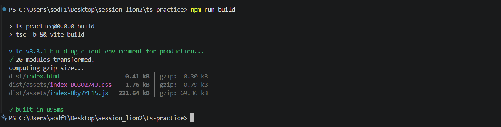
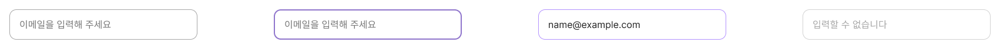
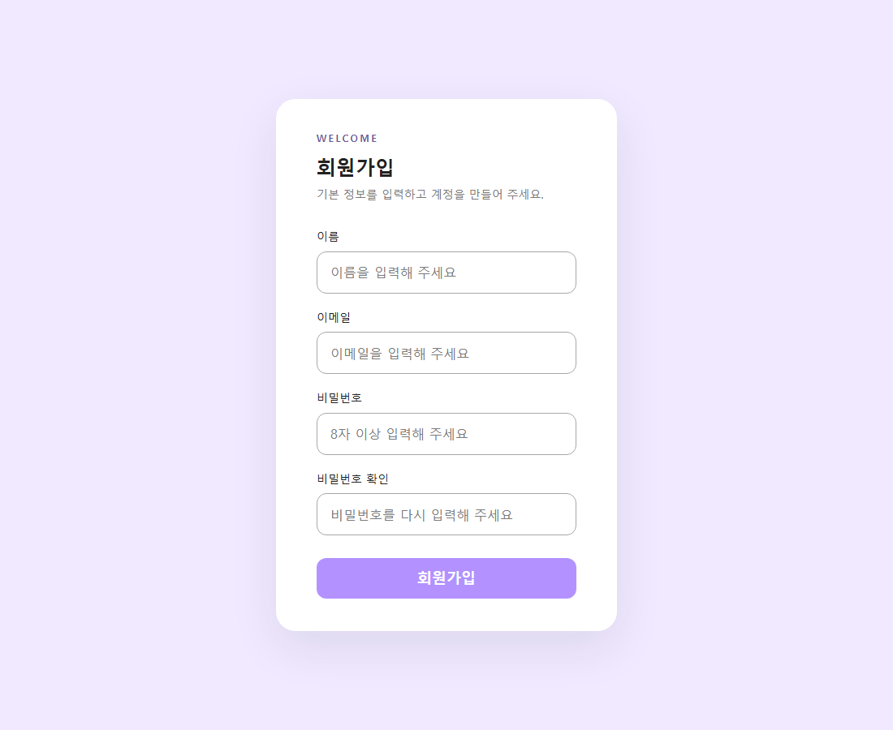

# 세션 과제 모음

## TypeScript To-Do 과제

JavaScript To-Do 앱을 React + TypeScript로 옮긴 과제입니다.
코드와 실행 방법은 [ts-practice 폴더의 README](ts-practice/README.md)에 있습니다.

```bash
cd ts-practice
npm ci
npm run dev
```

### 타입 검사 및 빌드 성공

`npm run build`가 끝까지 성공한 터미널 화면입니다.



### 필터 및 선택 동작

할 일 3개를 추가하고 하나를 완료 처리한 뒤 '진행중' 필터를 적용했습니다.
항목을 클릭하여 '선택한 할 일: 축구'가 표시된 화면입니다.


추가·필터·완료 처리 스크린샷과 타입 적용 설명은 [과제 README](ts-practice/README.md)를 참고하세요.

---
# 회원가입 페이지 과제

React, Vite, Tailwind CSS로 구현한 회원가입 페이지입니다.

## 실행

```bash
npm install
npm run dev
```

## 구현 내용

- 이름, 이메일, 비밀번호, 비밀번호 확인 입력
- 재사용 가능한 `Input` 컴포넌트: default, focus, filled, disabled 상태
- 세션에서 만든 `Button` 컴포넌트 재사용
- 비밀번호 일치 여부 확인 (회원가입 서버 API는 연결하지 않음)

## Figma 디자인

[소재일 페이지의 Input 컴포넌트](https://www.figma.com/design/dAX1eOnAZK1AUk4k9RVZhY/2026-2-Session?node-id=264-26)



## 회원가입 화면


