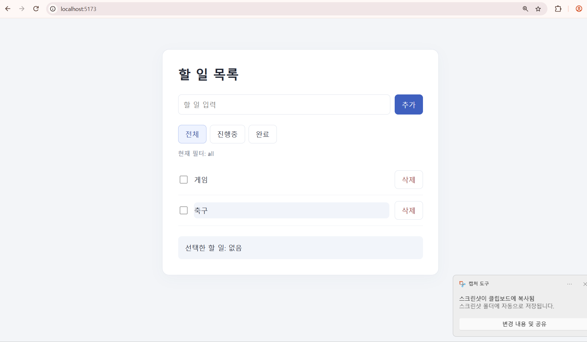
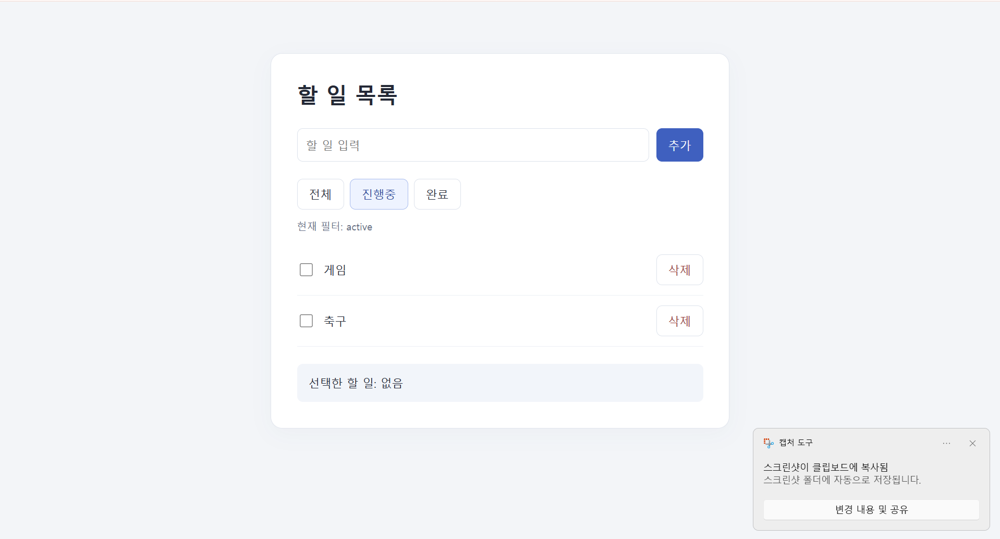
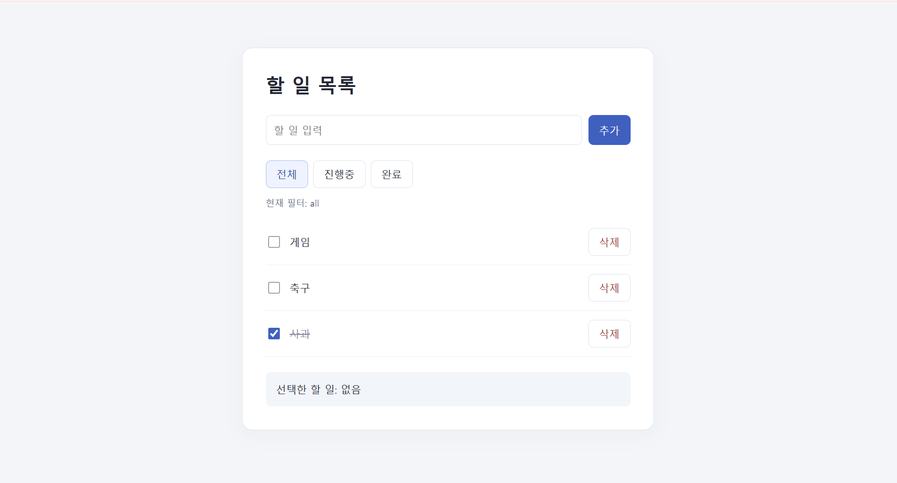

# Week2 — TypeScript To-Do 과제

멋쟁이사자처럼 TypeScript 세션의 JavaScript To-Do 앱을 React + TypeScript로 옮긴 프로젝트입니다.
할 일 추가, 완료 여부 변경, 삭제, 전체/진행중/완료 필터, 항목 선택 기능을 제공합니다.

## 실행 방법

저장소의 `Week2` 폴더에서 아래 명령어를 실행합니다.

```bash
npm ci
npm run dev
```

터미널에 표시된 로컬 주소를 브라우저에서 엽니다.
할 일의 글자를 클릭하면 하단에 선택한 할 일이 표시됩니다.
할 일은 React 상태에 저장되므로 새로고침하면 초기화됩니다.

## 타입 검사 및 빌드

```bash
npx tsc -b
npm run lint
npm run build
```

`npm run build`는 `tsc -b`로 타입을 검사한 뒤 Vite 빌드를 실행합니다.

## 과제 요구사항 적용

- TypeScript 타입 검사 오류 0개
- `any`, `as`, 과제 코드의 non-null assertion 사용 0회
- 템플릿 `src/main.tsx`의 non-null assertion만 과제 예외에 따라 유지
- 공용 타입 `Todo`, `TodoFilterValue`를 `src/types.ts`에서 export
- 각 컴포넌트의 props를 `interface`로 정의
- 필터에 리터럴 유니온 `"all" | "active" | "done"` 적용
- `find()`가 반환하는 `undefined`를 조건문으로 좁힌 후 선택한 항목 표시

`!todo.done`은 완료 여부를 반전하는 논리 연산자입니다.

## 제출 스크린샷

### 1. 타입 검사 및 빌드 성공

`npm run build`가 끝까지 성공한 터미널 화면입니다.


### 2. 필터 및 선택 동작

할 일 3개를 추가하고 '사과'를 완료 처리한 뒤 '진행중' 필터를 눌렀습니다.
진행중 항목 2개가 표시되고, '축구'를 클릭한 결과 하단에 '선택한 할 일: 축구'가 나타납니다.


### 3. 추가 동작 화면

전체 목록에 할 일 2개를 추가한 화면입니다.



'진행중' 필터를 적용한 화면입니다.



항목 3개 중 '사과'를 완료 처리한 화면입니다.



## 파일 구성

```text
src/
├── App.tsx          # 상태 및 추가/변경/삭제/필터/선택 처리
├── TodoInput.tsx    # 입력 상태와 입력 이벤트 타입
├── TodoItem.tsx     # 할 일 표시 및 콜백 props
├── TodoFilter.tsx   # 리터럴 유니온 필터와 콜백 props
├── types.ts        # 여러 파일에서 사용하는 공용 타입
├── App.css
├── index.css
└── main.tsx
```

`node_modules`와 빌드 결과인 `dist`는 `.gitignore`로 제외합니다.
